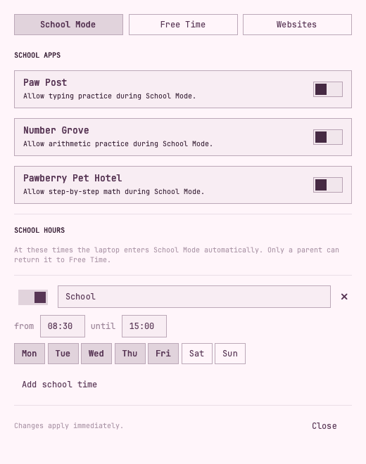
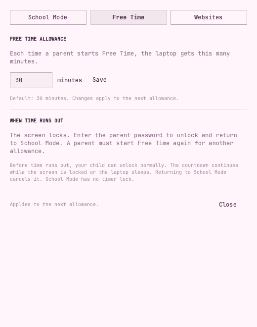
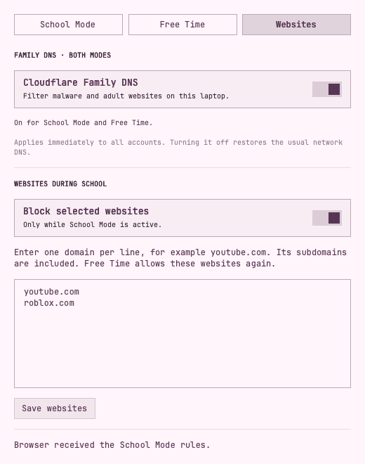
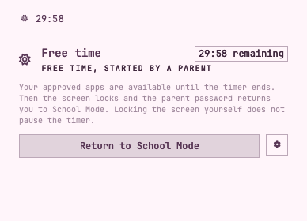
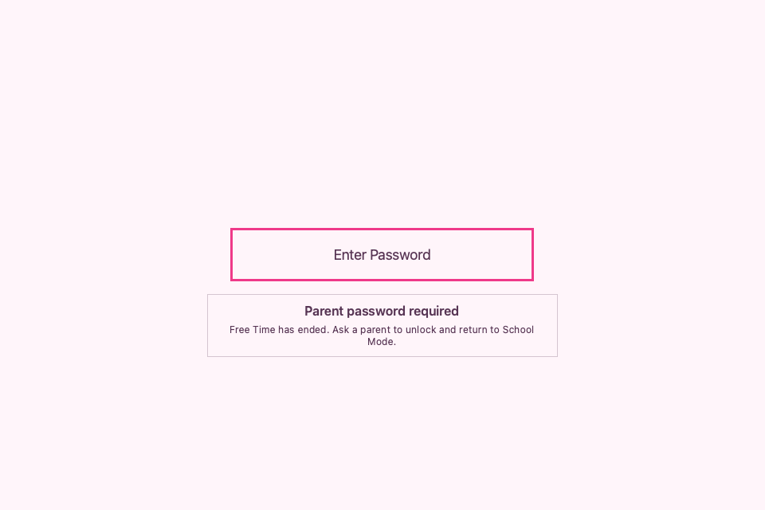

# School / Free Time

Approved apps, school schedules, optional website restrictions and Cloudflare Family DNS, and a parent-granted Free Time countdown in one plugin and one parent settings window. Free Time starts with **30 minutes** by default. When it expires, the native lock screen requires the **controls parent password**, then returns to School Mode.

A community plugin for **Omarchy Quattro with the Quickshell plugin system**. It works on a regular Omarchy installation; an Omarchy Kids ISO or fork is not required. The plugin ID is `io.github.peterholko.school-mode`.

## Screenshots

Local previews of the actual interface, using sample settings and the Bubblegum palette. Open an image to see it at full size.

| School Mode: learning games and school hours | Free Time: minutes per allowance |
| --- | --- |
|  |  |
| **Websites: Family DNS and School Mode restrictions** | **Free Time: live countdown** |
|  |  |

**After Free Time expires, the lock screen explains that a parent must unlock it.**



## How the timer works

- A parent chooses **Start Free Time** and enters the existing School Mode parent password. The bar and mode panel display the remaining time.
- In settings, **School Mode** contains the approved school apps and school hours. **Free Time** sets the minutes per allowance, from 1 to 1440. Changes apply to the next allowance.
- Locking the screen manually before expiry keeps normal password/fingerprint authentication. The countdown continues while locked, asleep or powered off; restarting does not grant more time.
- At expiry, the service locks the screen. If it is already locked, authentication becomes parent-only. The child password, fingerprint and automatic login cannot clear an expired allowance.
- The native Omarchy lock screen then shows **Parent password required** and **Free Time has ended. Ask a parent to unlock and return to School Mode.** The notice updates even when time runs out while already locked. It stays hidden on ordinary locks before expiry and in School Mode.
- Enter the **controls parent password** in the usual lock-screen password field. A successful expiry unlock ends Free Time and returns to School Mode. It does not grant another allowance.
- Entering School Mode before expiry cancels the timer. School Mode never initiates a timer lock. A scheduled school period that starts before expiry also cancels the allowance; ending school hours never grants Free Time automatically.

A parent can explicitly grant Free Time during school hours. Another scheduled School Mode start still takes precedence over a running allowance. If the laptop is restarted after both a deadline and a scheduled transition, the service settles whichever happened first. An already expired allowance stays parent-locked until acknowledged.

## Install

Run from the intended user's Omarchy desktop terminal. Replace `CHILD_USERNAME` with the local account, such as `linnea`:

```bash
omarchy pkg add python
omarchy plugin add https://github.com/peterholko/omarchy-school-mode --enable
sudo "$HOME/.config/omarchy/plugins/io.github.peterholko.school-mode/setup" --user CHILD_USERNAME --upgrade --omarchy-path "$OMARCHY_PATH"
omarchy bar put io.github.peterholko.school-mode --section right
python3 -I "$HOME/.config/omarchy/plugins/io.github.peterholko.school-mode/school-desktop.py" enable
omarchy-restart-shell
```

Setup installs this checkout's reviewed local service payload, the native lock authentication rules and the parent-password lock notice. Downloading the shell plugin alone cannot enable these integrations. Setup asks for a new **controls parent password** of at least eight characters if needed, and preserves an existing controls password. This password is separate from the child's login, sudo, disk password and the former Screen Time plugin's password or PIN.

Only the named account is enrolled. Root owns the password hash, schedules, deadline and expiry state. Passwords travel through stdin and a local Unix socket, never command arguments. The service authenticates callers using socket peer credentials and rate-limits failed parent-password attempts. PAM requests drop root privileges to the target child's UID before asking the service to check a typed password.

The installer checks ownership, command collisions and the previous service's file hashes. Unknown files, local modifications or a downgrade stop setup for review. It refuses to enroll an account configured for the original Omarchy Kids backend; it does not adopt that backend's settings or change OS account privileges.

These desktop controls assume the child cannot administer the laptop. An administrator can disable the service. The app menu and shortcut policy are not an application sandbox.

### Enable the approved desktop

In the enrolled user's desktop, run the following **without sudo**. This permits the plugin to hide the stock launcher and route `Super+Space` and `Super+Alt+Space` to the approved app list in both modes. School Mode disables the standard app-launch shortcuts, quiets notifications and parks existing windows. Free Time restores those windows and the previous notification preference while retaining the approved launcher and child shortcuts; windows are not closed.

```bash
python3 -I "$HOME/.config/omarchy/plugins/io.github.peterholko.school-mode/school-desktop.py" enable
```

Click the book/sun widget to enter School Mode or start a parent-approved Free Time allowance. Open its settings gear to use the **School Mode**, **Free Time** and **Websites** tabs. Free Time and changes to any settings require the controls parent password; the password field displays checking feedback. The settings include optional school access to Number Grove, Paw Post Typing and Pawberry Pet Hotel when their desktop launchers are installed. Other school desktop IDs can be configured with the client’s `config patch` command.

Free Time restores the existing [school and creativity app policy](docs/free-time-apps.md), plus the three learning games and Math Time. It does not expose every installed app. The policy matches exact desktop IDs; Discord, social/AI apps, supervision-only apps and unknown newly installed apps stay outside the launcher and its search. The default Omarchy menu's Community/Discord and app-install actions are not part of either child menu. Both retain Theme and Background under Style. Only installed apps appear; this update installs no applications.

The existing browser profile is retained. Free Time restores the approved browser, Files, Omawrite, Obsidian, Cliamp, Google Maps, Khan Academy and Wikipedia shortcuts through the same app checks as the launcher. As in the original child profile, `Super+Return` remains available in Free Time for parent maintenance. The filtered launcher and standard shortcut changes do not prevent custom shortcuts, terminal commands or manually started applications, and do not terminate existing processes.

The desktop helper journals recovery before applying changes and changes only its own `disabledPlugins` entry in `~/.config/omarchy/shell.json`. Other bar and shell settings are preserved. It keeps a first-use backup under `~/.local/state/omarchy-community-school-mode/`. Custom `XDG_CONFIG_HOME` and `XDG_STATE_HOME` are respected by the helper. Desktop consent and launcher restrictions survive logout, shutdown and shell restarts. While school status is loading, the launcher shows no apps and the helper applies the restrictive school shortcuts; window parking waits for confirmed School Mode. The helper checks live compositor bindings and repairs its shortcuts if a later startup or configuration reload replaces them. Run `school-desktop.py disable` before disabling or removing the plugin; this also revokes desktop consent.

### Manage enrollment and password

```bash
sudo omarchy-kids-controls password
sudo omarchy-kids-controls disable school --user CHILD_USERNAME
sudo omarchy-kids-controls enable school --user CHILD_USERNAME
```

## Websites

**Cloudflare Family DNS** is a separate, optional toggle at the top of this tab. Open the parent settings with the controls parent password, choose **Websites**, and flip the toggle. It saves immediately and filters malware and adult-content domains in **both School Mode and Free Time**, for **all accounts on the laptop**. It starts off. Wait for **On for School Mode and Free Time**; applying and error messages appear below the toggle. Turning it off restores the network's usual DNS settings. The selection survives reboots and network changes.

The resolver uses [Cloudflare's malware and adult-content addresses](https://developers.cloudflare.com/1.1.1.1/ip-addresses/): `1.1.1.3`, `1.0.0.3`, `2606:4700:4700::1113` and `2606:4700:4700::1003`. Chrome and Chromium use the system resolver while this toggle is on. Apps with their own DNS, proxies or VPNs can bypass system DNS; some private networks and captive portals may require a parent to turn this off temporarily. DNS lookups go to Cloudflare while enabled.

### Selected websites during School Mode

Website restrictions start **off**, with an empty list. After running the updated setup:

1. Open School / Free Time → settings and enter the controls parent password.
2. Choose **Websites**, turn on **Block selected websites**, and enter one domain per line, such as `youtube.com` or `roblox.com`. Save websites.
3. Reopen Chrome or Chromium after first enabling this feature. The Websites tab reports when a browser has received the rules; a saved list alone is not confirmation that the browser companion is running.

Domains include their subdomains: `youtube.com` also covers `www.youtube.com` and `m.youtube.com`. Use up to 100 different domains across enrolled profiles. Do not enter URLs, paths or ports. International domain names use their ASCII/punycode form.

**School Mode:** the saved domains are blocked, and already-open matching tabs in regular Chrome/Chromium windows move to a School Mode notice. Unrelated school tabs stay open. **Free Time:** these School-only restrictions are lifted; use the notice's retry button to return to a page. Pages do not reopen or start playing automatically. A scheduled School Mode start, reboot into School Mode, or parent unlock after Free Time expiry reapplies the rules. Websites never trigger a screen lock or change the timer.

Chrome/Chromium policies apply to **all accounts on this laptop**. With multiple enrolled children, the effective list is the union of the enabled lists for accounts currently in School Mode. Another child's active School Mode can therefore keep a domain blocked during your account's Free Time; the tab reports this. Existing restrictions from other software remain in effect.

The selected-domain list applies to Chrome and Chromium. Firefox, other browsers, native apps, proxy sites and manually altered browser launches are outside this list's scope. The companion handles existing tabs in regular browser windows; it does not inspect existing Incognito/Guest tabs. Chrome's managed URL policy handles new navigations there, but close any existing private windows before relying on a School transition. This list works independently of the Family DNS toggle; Free Time releases the School-only list while Family DNS stays enabled if selected.

The browser companion and rules are local. No browsing history, visited URLs, accounts or passwords are sent to a server. Conflicting administrator browser policies are reported in settings rather than silently replaced. See [website integration details and troubleshooting](docs/websites.md).

## Update

Version **2.3.0**, with shared service **4.4.0**, adds the parent-controlled Cloudflare Family DNS toggle to Websites. Update both the plugin and its installed service from the child's unlocked desktop terminal. Replace `CHILD_USERNAME` with the local account, such as `linnea`:

```bash
omarchy plugin update io.github.peterholko.school-mode --yes
sudo "$HOME/.config/omarchy/plugins/io.github.peterholko.school-mode/setup" --user CHILD_USERNAME --upgrade --omarchy-path "$OMARCHY_PATH"
omarchy-restart-shell
```

Wait for the bar to return, then reopen the app launcher. A plugin rescan alone can leave previous QML running. Upgrading from service 4.2.0 needs setup and a shell restart, but no reboot. When upgrading from a release without the Free Time timer, also enable the approved desktop as described above, then save your work and reboot once to activate the authentication changes. Website restrictions remain off until a parent enables them in the Websites tab.

Existing parent passwords, school app approvals, schedules, desktop recovery information, game progress and Pawberry daily counts are retained. An old unlimited Free Time override returns to School Mode on migration; a parent must start the first timed allowance. The service still includes the current practice-only game endpoints and cannot restore time rewards. For this shared service upgrade, use this repository's setup; an older game's service payload cannot downgrade it.

The launcher compatibility, approved Free Time apps, standalone Math Time entry, startup recovery and readable status publication fixes from earlier releases are included.

### Lock-screen notice

The notice reads only the enrolled user's public expiry status. It does not read passwords, change the password field, authenticate anyone or initiate a lock. The existing PAM rules continue to enforce parent-only unlock after expiry. The message is for the native Omarchy lock screen; separate SDDM or Hyprlock interfaces retain their own appearance.

Omarchy currently has no plugin API for lock-screen messages, so setup adds a small, marked loader to `$OMARCHY_PATH/shell/plugins/lock/LockView.qml`. The installed Omarchy tree must be root-owned and not writable by other users. The display component is root-owned under `/usr/lib/omarchy-kids-controls/lock-notice/`; a private receipt records only the exact inserted block. Setup and removal preserve the rest of Omarchy's file and stop if that block was edited.

An Omarchy package update can replace the lock view and remove the notice. Rerun the setup command above and `omarchy-restart-shell` to reapply it to the current supported view. This never restores an older copy of Omarchy's lock screen. Passing `--omarchy-path "$OMARCHY_PATH"` preserves the selected installation path even when sudo clears the environment.

### Diagnose an empty launcher

While the problem is happening, open the launcher once and run:

```bash
omarchy-shell shell call io.github.peterholko.school-mode diagnostics "" | python3 -m json.tool
```

This reads the running launcher's service connection, a fresh host lookup, and installed/approved/displayed app counts. It does not open an app or change settings. A working current host should report `serviceSource: "injected"` and a connected, enabled service. A healthy root service status file alone does not prove the launcher has that connection. Preserve this output before restarting; it distinguishes a missing connection from an empty app provider. Launcher opens with missing status also write this diagnostic to the `omarchy-shell` journal.

If the formatter reports `Expecting value`, run the diagnostic without `| python3 -m json.tool` to see the raw response. `unknown` means the menu instance or diagnostic method is unavailable. If the plugin checkout is current, restart the shell with `omarchy-restart-shell`, reopen the launcher and try the diagnostic again.

## Native authentication and recovery

Setup wraps `/etc/pam.d/omarchy-lock-password` and, when installed, `omarchy-lock-fingerprint`, `hyprlock`, `sddm` and `sddm-autologin`. Exact originals are retained as `/etc/pam.d/omarchy-school-original-SERVICE`, with a private receipt at `/etc/omarchy-kids-controls/school-pam.json`. It leaves global `system-auth`, sudo, TTY recovery and other accounts' normal authentication policy intact.

The gate checks live policy before and after normal authentication, so expiry during a password or fingerprint attempt cannot slip through. Password entry can authenticate the parent after expiry; fingerprint and autologin cannot. The parent unlock commits School Mode before authentication succeeds. Original PAM rules run as a substack so their internal success jumps cannot skip the final expiry check.

If the controls service is unavailable, enrolled accounts' managed lock/login paths refuse authentication until the service is restored or an administrator disables their enrollment. Recover from an administrator terminal or TTY with:

```bash
sudo systemctl restart omarchy-kids-controls.service
```

If necessary, temporarily release a specific account:

```bash
sudo omarchy-kids-controls disable school --user CHILD_USERNAME
```

If an Omarchy update or authentication setup replaces PAM rules, rerun School Mode setup. New Free Time grants are refused until the expected wrappers are present. Setup and removal refuse to overwrite administrator edits and can resume an interrupted installation or removal using the recorded originals.

### Service paths and dependencies

The service uses Python 3's standard library, Linux PAM, systemd/logind, OpenSSL and Omarchy's native shell/lock/notification commands. Desktop effects use Bash 5, Hyprland's Lua IPC, jq and flock, supplied by Omarchy. No pip packages, hosted services or API keys are needed. The optional website companion installs from a loopback-only endpoint on the laptop; it requires Chrome or Chromium.

- Code: `/usr/lib/omarchy-kids-controls/`
- Administration: `/usr/bin/omarchy-kids-controls`
- PAM helper: `/usr/bin/omarchy-kids-controls-school-pam`
- Lock notice receipt: `/etc/omarchy-kids-controls/school-lock-notice.json`
- Unit: `/etc/systemd/system/omarchy-kids-controls.service`
- Private configuration and password: `/etc/omarchy-kids-controls/`
- Private state and per-user read-only status: `/var/lib/omarchy-kids-controls/`
- Local socket: `/run/omarchy-kids-controls/sock`

## Remove

First restore the desktop in each enrolled user's active session, without sudo:

```bash
python3 -I "$HOME/.config/omarchy/plugins/io.github.peterholko.school-mode/school-desktop.py" disable
```

Remove the School service module before removing the shell plugin. This restores its original PAM entry points, removes the owned lock-screen loader and removes its PAM backups/receipt, owned browser policies and native-messaging manifests. The browser removes its managed companion; its managed-policy removal handler also clears persistent request rules:

```bash
sudo omarchy-kids-controls remove school
omarchy plugin remove io.github.peterholko.school-mode
omarchy-restart-shell
```

If another module is installed, its shared service and settings remain. Removing the last module removes the service, unit and owned commands. Configuration, passwords and history are retained for a deliberate reinstall. Locally modified installed files stop automatic removal for review.

## License and source

MIT. See [LICENSE](LICENSE) and [ATTRIBUTION.md](ATTRIBUTION.md) for retained copyright notices and asset provenance. [SOURCE.json](SOURCE.json) records the original export's provenance; this repository now maintains the standalone School / Free Time plugin.

## Validation

```bash
omarchy plugin validate .
python3 -m unittest discover -s tests -v
node --test tests/websites.test.cjs
python3 tests/visual.py --omarchy "$OMARCHY_PATH" --output /tmp/school-mode-visual-check
python3 tests/visual-lock.py --omarchy "$OMARCHY_PATH" --output /tmp/school-lock-visual-check
```

Local tests require PySide6, Bash, jq, OpenSSL and Node.js. They exercise policy deadlines, schedule/reboot ordering, parent authentication, helper UID handling, temporary PAM/browser installation and removal, signed packages, native messaging, service upgrades, game progress, launcher filtering, status permissions and desktop recovery. The visual check uses the real plugin QML and Omarchy controls with portable window and process adapters; inspect its screenshots. No test runs a real lock, systemd installation, GitHub Actions or an ISO. An optional isolated Chromium check is described in [docs/websites.md](docs/websites.md).

For preview captures on a machine without Omarchy's fonts, `tests/visual.py` accepts `--font /path/to/JetBrainsMonoNLNerdFontMono-Regular.ttf --font-family "JetBrainsMonoNL Nerd Font Mono"`. The font is loaded only for that preview process. The README screenshots use these preview tools with the Bubblegum palette.

The Linux PAM integration still needs a manual check on an Omarchy laptop: set a one-minute allowance, verify a child can unlock a manual lock before expiry, let the allowance expire, confirm the parent-password notice appears and the child password/fingerprint are refused, then enter the controls parent password and confirm School Mode resumes. Repeat with expiry while already locked and after suspend/reboot. Restore the preferred allowance afterward.
